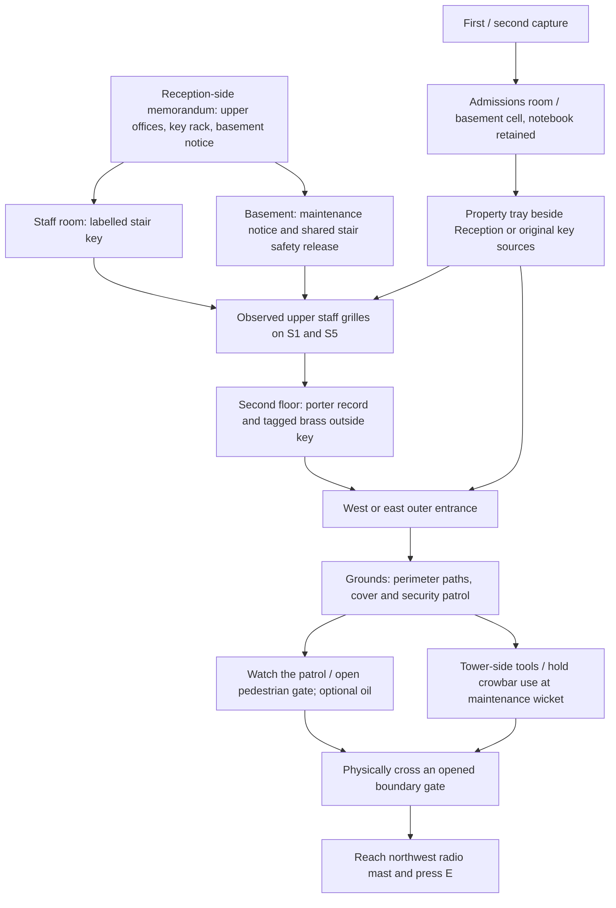

# Escape chain and capture recovery

Items 1 and 2 use the existing four-floor browser interior and continuous stairs.
This is a fictional escape scenario in the current site model. It does not assert
that the modern mast or the staff arrangements existed in 1829.

The first and first-to-second floor stairs coexist in the scene and are walked
continuously. Only the upper staff stair connections have scenario grilles.
The first floor and basement can be explored from the start. The two upper wings
connect through the first floor. An office filing notice downstairs names the
current record room, so neither branch depends on blindly searching both wings.

Fixed dependencies: a physical upper access method, the upstairs brass key,
an outside door, leaving the grounds and reaching the mast. Branches: take the
stair key (opens either grille), or operate the basement release (opens both).
Variants selected once per run: key rack in G23/G24 (internal R23/R25), record
in second-floor 201/209 (internal R41/R49), service door D2/D8. Narrative notices,
notebook entries and maps use the same player numbers as the physical door plaques.
All combinations use reachable sources outside their own locks.
`?seed=1829` reproduces scenario choices; ordinary retries choose a new seed.
Furniture retains its existing independent variation.

Knowledge is evidence-based and order-independent. No clue is a mandatory read:
physical tags, notices and visible fittings also communicate the puzzle.
The notebook helps recover context after a break and preserves that knowledge
when possessions change. Its map does not reveal future areas or add an arrow
or undiscovered item marker. The HUD starts each objective with a short direction.
After 60 seconds of active play without progress, it adds a more explicit hint;
this supersedes the immediately detailed HUD guidance from 6 October. The staff
key initially prompts “Use the key you found to access the staff stairs”, then
adds “Find the porter’s records and brass outside-door key.” The upper-office
hint names the record room and explains the first-floor crossing when needed.
Changing objectives, taking a tool, opening a gate and capture reset the delay.
Movement within an objective, repeated interactions and incidental clue reads
do not restart it. Pause, notebook, artwork, arrival and capture screens do not
advance it; it uses active frame time rather than the capped movement timestep.
Gate/release confirmations announce that access opened without giving away the
next item. Physical notices and discovered notebook evidence retain their details.
Available fittings have a bright gold halo and a small camera-facing glow above
them, so desk papers can be recognised from their doorway. The glow pulses during
play, stays steady with reduced motion, respects occlusion and clears after use.

| Entry | Exact trigger |
| --- | --- |
| Staff memorandum | Inspect the Reception-side memorandum |
| Staff circulation deduction | Memorandum + physically observed staff grille |
| Staff stair key | Take the labelled rack key |
| Upper stair grille | Approach a locked upper grille |
| Paired rear stairs deduction | Physically approach both S3 and S4 |
| Maintenance notice | Inspect basement notice |
| Service connection deduction | Maintenance notice + observed grille |
| Staff stair safety release | Operate the basement release |
| Staff stair access | Use a carried stair key on a grille |
| Office filing notice | Inspect first-floor notice naming current record room |
| Porter service record | Inspect the upstairs record |
| Tagged brass key | Take the key attached to that record |
| Outer entrance | Physically test the active outside lock; evolves on use |
| Grounds route deduction | Upstairs record + physically tested active door |
| Mast landmark | Read its description in the upstairs record or see it outside |
| Grounds gates and tool store | Approach a gate or take a tool; record only observed positions |
| Beyond asylum grounds | Cross the plane of an opened north gate from the inside |
| Confiscated property | Capture with keys; evolves when reclaimed |
| Returned under supervision | First or second capture |

All knowledge, fog, locks, possessions and capture counts reset on a new run.
Notebook and artwork inspection suspend gameplay. Holding use elsewhere does
not freeze pursuit. The old grid-layout test fixture retains its legacy loop.
Explore has no scenario fittings, locks, capture or completion triggers.

Capture 1: admissions room beside Reception, keys confiscated, changed patrol and ten seconds
to recover. Capture 2: basement padded cell, four seconds of observation followed
by recovery time. Capture 3: the existing historical diagnosis/treatment result.
Elapsed gameplay time and discoveries persist; opened upper grilles remain open.
Both original key sources and the Reception property tray prevent soft locks.
The cell door is released after observation; the player is not trapped behind an
unobtainable key. Capture has no automatic restart or reset of the scenario seed.

The final interaction is simple, at the existing mast base. An Escape-only copy
of the mast is visible in the 1916 night backdrop, with a walkable footing.
Its batches and cached transforms are prepared before invalidating shadows;
the dated Aerial and Explore models retain their timeline behavior. Reaching an outside
door or the old front-path threshold cannot end the game. The existing estate
ending plays after this interaction. No shared exterior modelling input changes.

Validation must cover every scenario combination, both access methods, out-of-order
discoveries, capture before/after each dependency, lost-key recovery, restart,
physical gate rejection including jump, real ground routing, ending and desktop/
touch journal/recovery dialogs. Local rendering uses the hardware browser launcher.

## Outdoor choices — 7 October 2026

The continuous Escape-only boundary supersedes the old Z=-50 progress threshold.
Reaching an arbitrary coordinate outside the site cannot satisfy the ending:
the player must physically cross one of the two open north gates. Re-entering
across that boundary or being captured clears this condition. The mast remains
the final interaction after either route.

The pedestrian gate is unlatched. Using it opens its leaf permanently for that
attempt, making a sound audible within 48 units unless the player carries oil.
The maintenance wicket needs a crowbar and three seconds of held use. Its
hammering/prising sounds reach 65 units. Releasing use, leaving the fitting or
losing the tool cancels partial work. Security continues moving during work;
Notebook and pause freeze the entire interaction. The workshop-side crowbar and
oil can are optional for the pedestrian route, and neither requires a new key.
After capture both tools return to their interior benches; opened doors and
gates remain open.

One outdoor guard patrols a small set of destinations using the existing
collision-aware routing. Facing and unobstructed sight determine detection,
with close-range awareness. Visible pursuit takes priority over sounds. Hearing
records only the sound's position. The guard walks there, searches for six
seconds, then returns to its patrol; it never tracks an unseen player's current
position. Blocked/unreachable routes have a bounded search/return fallback.
Opening gates and refreshing tree collisions invalidate cached paths.

The blue stores door beside the water tower opens inward onto the established
connecting corridor. Three connected rooms supply a repair bench and crowbar,
an oil and parts store, and a machine workshop. Tools require entry through
that door. The red/cream brick and tile-band finishes follow the saved corridor
photographs; the hidden partitions and equipment are fictional gameplay fittings.

The corridor sits directly against the water tower, whose existing masonry
forms its west wall; the adjoining room partitions and fittings follow the
shifted passage. The owner's purple route annotations extend exploration
along the main/admin, Irby/Ashley, Hale, Upton/Frith/Oscroft, Grafton/Edge and
Witby links. Locked double doors stop passage at all six yellow lines and the
remaining ward contacts. Nine aged direction boards at the red X junctions
list destinations with arrows relative to the approaching player.

The tools, wicket and workshops use procedural geometry, shared materials and
local textures, with workshop and corridor lights and no additional model/texture/audio
downloads. They are excluded from Explore and the shared compiled estate.
Affected building batches and collision transforms are refreshed; disposal
restores the exact original estate before a restart. The outside notebook covers
the complete workshops; their outline follows the normal exploration fog and
interaction markers appear only after discovery. The HUD names the current room.

Run `npm run test:grounds` for the focused logic and hardware browser checks.
The existing `test-escape-progress-browser.mjs` walkthrough now uses the pedestrian
gate and waits for streamed interior sections before accelerated movement.

## Optional water tower climb — 8 October 2026

The porter’s record plants a tower inspection lead. A high lamp marks the
lookout; the vestibule notice names the crowbar and oil in the adjoining rooms.
Holding use for three seconds with the crowbar frees the tower entrance. Oil
quiets the hinge; otherwise the noise can draw the existing outdoor guard to
the workshop yard. The sound supplies a fixed investigation point, never the
player's subsequent position. There is no valve puzzle or water diversion.

Twelve flights and corner landings rise continuously to a 26.6-unit lookout
within the tower silhouette. Normal walking and jumping use the physical
treads, rails and landings in both directions. The existing small west window
and all three pairs of narrow arched slits on each of the four sides provide
views of the grounds, including rows without a walk-up landing. Their original
surrounds and positions remain, with one masonry surface per jamb, sill and
curved head. Movement guards contain the player at every opening. A water riser, overhead
tank, warm lamps, drops and footstep echoes establish the interior. Nearby
moving security produces yard footsteps and a one-time text cue, including
when sound is disabled. The outdoor camera range increases from 150 to 600
so the distant mast can actually appear from the tower; the outdoor near
plane is .18 to retain depth precision. Interior clipping remains .05–150.

Inspecting the lookout records directions to both gates and the mast, without
revealing live enemy markers or unexplored map areas. The objective then
directs the player down the same stairs. There is no countdown or new key;
both original gate routes still work without climbing. The guard responds to
a noisy entry while the player ascends and descends, and eventually resumes
patrol. Oil rewards preparation with a quieter approach.

Capture preserves the freed hatch, oil applied and lookout discovery; carried
tools still return to their benches. Retry resets tower progress and restores
the original estate before constructing the next runtime interior. Reading
and pause suspend progress; ambience runs only during play. These are Browser
Escape fittings, not historical evidence or changes to Explore/Aerial/native.

Run `npm run test:tower` for physical ascent/descent, both noise branches,
evidence, pause, capture/retry, original restoration and GPU desktop/touch
checks. Captures and receipts are in `Browser/artifacts/escape-tower/`.
