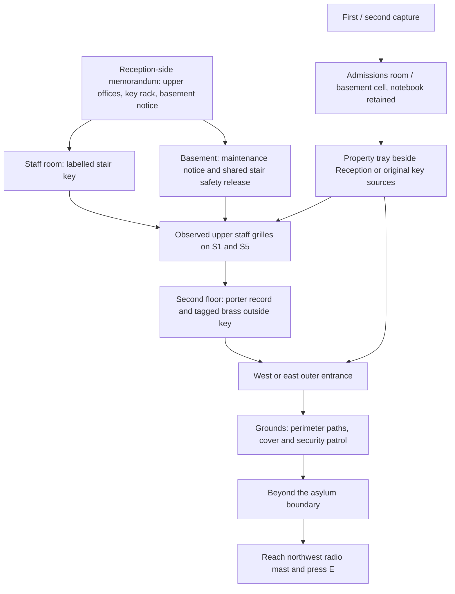

# Escape chain and capture recovery

Items 1 and 2 use the existing four-floor browser interior and continuous stairs.
This is a fictional escape scenario in the current site model. It does not assert
that the modern mast or the staff arrangements existed in 1829.

The first and first-to-second floor stairs coexist in the scene and are walked
continuously. Only the upper staff stair connections have scenario grilles.
The first floor and basement can be explored from the start. The two upper wings
connect through the first floor. An office filing notice downstairs names the
current record room, so neither branch depends on blindly searching both wings.

Fixed dependencies: a physical upper access method, the upstairs brass key,
an outside door, leaving the grounds and reaching the mast. Branches: take the
stair key (opens either grille), or operate the basement release (opens both).
Variants selected once per run: key rack in G23/G24 (internal R23/R25), record
in second-floor 201/209 (internal R41/R49), service door D2/D8. Narrative notices,
notebook entries and maps use the same player numbers as the physical door plaques.
All combinations use reachable sources outside their own locks.
`?seed=1829` reproduces scenario choices; ordinary retries choose a new seed.
Furniture retains its existing independent variation.

Knowledge is evidence-based and order-independent. No clue is a mandatory read:
physical tags, notices and visible fittings also communicate the puzzle.
The notebook helps recover context after a break and preserves that knowledge
when possessions change. Its map does not reveal future areas or add an arrow
or undiscovered item marker. The HUD shows one current objective with a room,
action and use key; this supersedes the earlier restriction on explicit objective
guidance, following the owner's 6 October feedback. Opening a gate or operating
the release supplies the porter-record room from its physical notice. Upstairs
guidance distinguishes the Library office from the office above Reception and
explains the first-floor crossing when the player is in the other upper wing.
Taking the brass key, entering the grounds and capture/recovery update the action.
Available fittings have a bright gold halo and a small camera-facing glow above
them, so desk papers can be recognised from their doorway. The glow pulses during
play, stays steady with reduced motion, respects occlusion and clears after use.

| Entry | Exact trigger |
| --- | --- |
| Staff memorandum | Inspect the Reception-side memorandum |
| Staff circulation deduction | Memorandum + physically observed staff grille |
| Staff stair key | Take the labelled rack key |
| Upper stair grille | Approach a locked upper grille |
| Paired rear stairs deduction | Physically approach both S3 and S4 |
| Maintenance notice | Inspect basement notice |
| Service connection deduction | Maintenance notice + observed grille |
| Staff stair safety release | Operate the basement release |
| Staff stair access | Use a carried stair key on a grille |
| Office filing notice | Inspect first-floor notice naming current record room |
| Porter service record | Inspect the upstairs record |
| Tagged brass key | Take the key attached to that record |
| Outer entrance | Physically test the active outside lock; evolves on use |
| Grounds route deduction | Upstairs record + physically tested active door |
| Mast landmark | Read its description in the upstairs record or see it outside |
| Beyond asylum grounds | Physically cross the rear perimeter |
| Confiscated property | Capture with keys; evolves when reclaimed |
| Returned under supervision | First or second capture |

All knowledge, fog, locks, possessions and capture counts reset on a new run.
Notebook and artwork inspection suspend gameplay. Holding use elsewhere does
not freeze pursuit. The old grid-layout test fixture retains its legacy loop.
Explore has no scenario fittings, locks, capture or completion triggers.

Capture 1: admissions room beside Reception, keys confiscated, changed patrol and ten seconds
to recover. Capture 2: basement padded cell, four seconds of observation followed
by recovery time. Capture 3: the existing historical diagnosis/treatment result.
Elapsed gameplay time and discoveries persist; opened upper grilles remain open.
Both original key sources and the Reception property tray prevent soft locks.
The cell door is released after observation; the player is not trapped behind an
unobtainable key. Capture has no automatic restart or reset of the scenario seed.

The final interaction is simple, at the existing mast base. An Escape-only copy
of the mast is visible in the 1916 night backdrop, with a walkable footing.
Its batches and cached transforms are prepared before invalidating shadows;
the dated Aerial and Explore models retain their timeline behavior. Reaching an outside
door or the old front-path threshold cannot end the game. The existing estate
ending plays after this interaction. No shared exterior modelling input changes.

Validation must cover every scenario combination, both access methods, out-of-order
discoveries, capture before/after each dependency, lost-key recovery, restart,
physical gate rejection including jump, real ground routing, ending and desktop/
touch journal/recovery dialogs. Local rendering uses the hardware browser launcher.
