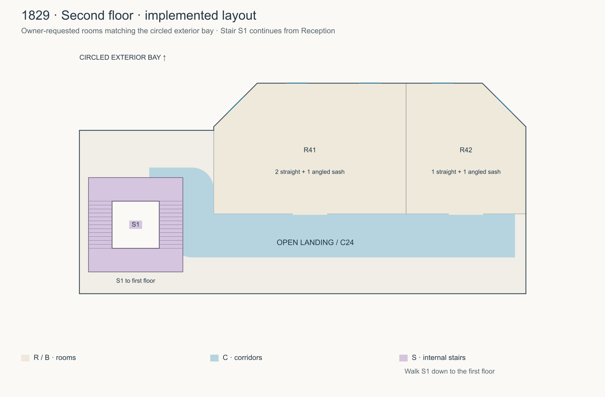
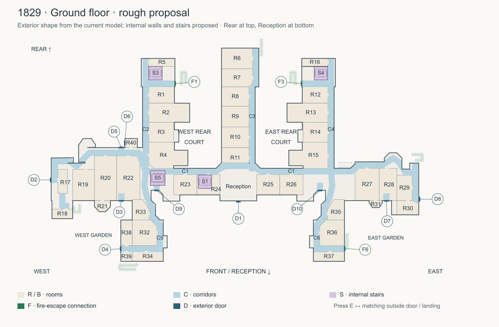
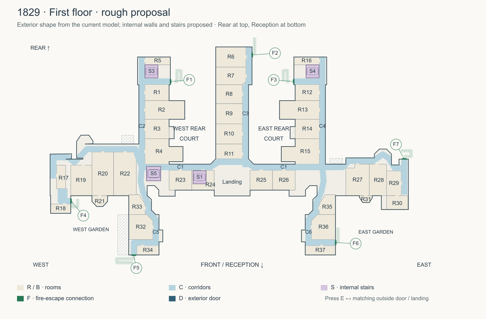
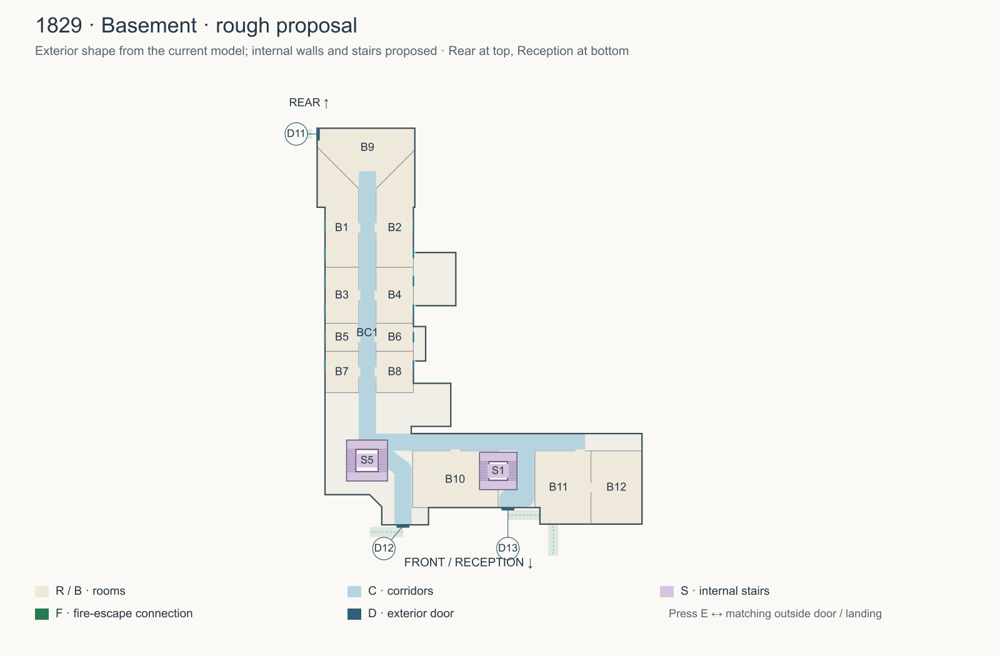

# 1829 revised interior plans — 2 October 2026

## Enclosed room joins across all floors (3 October 2026)

The owner's [marked pillar-and-gap view](room-closures-reference.png) and
follow-up request apply the same repair to matching joins throughout the
building. R33's west forward entrance now matches R35's closed diagonal on
both ground and first floors: (-36.9, 19.1) to (-34.5, 22.85), mirrored in the
east. The loose corner piers are removed. R32/R36's forward-room diagonals
also match on both levels, with corresponding outside 45-degree corners
retaining the already reviewed corridor clearance.

R22's west cross-range return now continues upstairs. R11 gains its missing
southern boundary beside the central corridor, with its side doorway and P1
connection retained. R17 is enclosed between x=-69.65 and -66, z=7.4 and 16.7;
the reserved north/east/south lobbies keep D2, R18 and F4 connected without
passing through the room. R30's ground-floor return runs from (67.1, 19.5) to
(69.7, 20.5), enclosing the room beyond D8's perpendicular lobby. Basement
B11's west wall follows x=-7.8 from z=9.4 to 17.3, removing its short isolated
pier while leaving the Reception stair and D13 lobby accessible.

Explicit room variants retain these complete boundaries instead of clipping
them to corridor widths. Visible masonry, skirting, walking collision,
navigation and notebook maps use the same plan. R27's separately reviewed
ground-floor diagonal and first-floor L-shaped return are preserved. The
second-floor rooms are already enclosed; the four-floor audit finds no
additional loose room-wall ends beyond fitted openings and stair mouths.

Both shared JSON copies and the ground/first/basement SVG/PNG drawings are
updated. These are owner-directed gameplay dimensions. Browser interior
sources and drawings are updated; Unity, Blender and packaged exports were
not regenerated. The aerial compiler excludes these inputs and its existing
compiled manifest still matches its sources. Validation and before/after
views are in `../../Browser/artifacts/wing-room-closure/` and
`../../DEVELOPMENT.md`. This supersedes the earlier ground-floor-only scope
for the R35 pillar and R36 enclosure.

## Ground-floor cross-range bends, east and west (3 October 2026)

The owner's [purple/yellow marked view](east-ground-bend-reference.png)
closes R27's ground-floor northwest opening between the existing wall ends:
(45.1, 8.5351) to (46.6140, 7). The opposite square outline corner at
(45.1, 7) is cut back by 1.75 on both sides, creating the requested 45-degree
face from (43.35, 7) to (45.1, 5.25). The floor and ceiling fill that triangle.
The C1 corridor keeps just over 2.1 units of clear width at this bend, and
R27's green doorway remains at (49.75, 7).

The follow-up request covers the corresponding west bend. Its proportions
are different: R22's northeast opening joins (-39.0976, 2.2) to (-38, 5.2658).
Opposite it, R4's southwest square room corner becomes a 45-degree face from
(-34.6, 5.25) to (-32.85, 7). Both existing room doorways remain fitted and
walkable. Ground-floor variants retain the complete new room edges instead
of allowing corridor-width clipping to reopen them. Cream upper brick, red
lower brick and dark skirting share the collision and mapping boundaries.

Both plan JSON copies and the ground-floor SVG/PNG drawing are updated.
These owner-directed gameplay corrections supersede R27's old ground-floor
corner; its separate first-floor enclosure retains its established boundary.
R27's ground-floor diagonal is deliberately independent of that first-floor
L-shaped return; general room-closure updates should preserve this marked face.
The aerial compiler excludes these interior inputs, so no aerial rebuild is
needed. Unity, Blender and packaged exports are not regenerated. Checks and
reviewed views are under `../../Browser/artifacts/east-ground-bend/`;
validation details are in `../../DEVELOPMENT.md`.

## Regular interior doorway thickness (3 October 2026)

The owner's green-doorway screenshot requests regular wall thickness for all
interior surrounds in this style. R21, R30 and R31's north partitions were
offset from the adjoining cross-range partitions, giving their ground/first
floor frames depths of 0.58, 0.83 and 0.58 scene units respectively. Both shared
plan copies now align those north edges at z=19.5. All 89 interior openings
therefore use the existing 0.18-unit masonry depth, with the same timber
returns, casing, clear opening and level threshold as the other room doors.
This supersedes the deep bay-room jambs described in the October 2 entry.

Masonry, skirting, collision, navigation and notebook mapping derive from the
corrected room boundaries. The ground/first-floor SVG/PNG drawings are
regenerated. Eight affected wall-join probes follow the corrected corners;
R30's ground-floor outside pier is checked beyond D8's retained aperture.
These are owner-directed gameplay dimensions, not historical measurements.
Validation and before/after views are in
`../../Browser/artifacts/interior-door-thickness/` and `../../DEVELOPMENT.md`.
The separate aerial compiler excludes this interior input; Unity, Blender
and packaged exports are not regenerated for this repair.

## East rear ground-floor wall closure (3 October 2026)

The owner's [purple-line reference](east-rear-wall-reference.png) closes the
gap between R16's south wall and the masonry beside its framed entrance,
across the front of stair S4. The complete ground-floor wall runs along
z=-32.4 from x=24.5 to x=34.6; the formerly missing span starts at x=29.11.
The wall retains the room doorway at (34.6, -34), matching cream/red masonry
and dark skirting on both faces, and the existing first-floor opening.

R16's ground-floor variant marks this edge as solid, preventing general
stair-clearance clipping from removing it. Shared game/review plans and the
ground-floor SVG/PNG are updated. Collision, navigation and notebook mapping
use the same boundary. Stair S4 remains accessible from the corridor-side
landing; descent turns sideways onto that landing instead of continuing
through the enclosed room wall. F3's fire-exit lobby remains open.

These are owner-directed gameplay dimensions. Browser interior sources and
the ground-floor drawing are updated; Unity, Blender and packaged exports
were not regenerated. Validation and before/after game views are recorded
in `../../Browser/artifacts/east-rear-wall/` and `../../DEVELOPMENT.md`.

## East ground-floor corridor join and opposite corner (3 October 2026)

The owner's [purple/blue marked view](east-corridor-reference.png) joins R36's
existing north wall end at (33.8375, 27) to its west wall end at (31.45, 29.42).
The opposite outside corner is cut back 1.75 units on each side, making a
continuous 45-degree face from (32, 25.25) to (30.25, 27). Cream/red masonry and
dark skirting follow both new faces. This gives the diagonal passage about
2.35 units of clear width, rather than leaving the old corner projecting
into it. The ground-floor floor/ceiling outline fills the cut-back triangle.

R36's explicit ground-floor boundary retains its doorway piers without
corridor-width clipping. C6 follows the open northwest side of the new wall
and reaches the existing forward corridor and R36 west doorway. Both green
room doorways remain fitted and walkable. R35 and the other floor boundaries
are unaffected by this particular correction.

Both shared plan JSON copies and the ground-floor SVG/PNG drawing are updated.
Visible walls, collision, navigation and notebook mapping consume the same
boundaries. These are owner-directed gameplay dimensions. Browser sources
and drawings are updated; Unity, Blender and packaged exports were not
regenerated. The separate aerial compiler excludes these interior inputs.
Validation and before/after views are in `../../Browser/artifacts/east-corridor/`
and `../../DEVELOPMENT.md`.

## East first-floor wall and room enclosure (3 October 2026)

The owner's [marked first-floor view](east-first-wall-reference.png) removes
R27's projecting north-wall section beside its green doorway and encloses
the room along the purple L-shaped floor line. The new return runs from
(45.1, 8.5351) to (48.62, 8.5351), then to (48.62, 7), meeting the existing
western wall and a short fitted doorway pier. Cream/red masonry and dark
skirting continue around both corners. The doorway stays at (49.75, 7),
and the existing C1 cross-corridor approach remains accessible.

Both shared plan JSON copies and the first-floor SVG/PNG drawing are updated.
Visible walls, walking collision, navigation and notebook mapping use these
boundaries. Ground-floor R27 and the separate R35 ground-floor correction
retain their existing boundaries.
These are owner-directed gameplay dimensions. The aerial compiler excludes
the interior, so no compiled aerial rebuild is needed. Unity, Blender and
packaged exports were not regenerated. Validation and before/after views are
in `../../Browser/artifacts/east-first-wall/` and `../../DEVELOPMENT.md`.

## Matching masonry around all outside doors (3 October 2026)

The owner's rear east-wing screenshot identifies F3's oversized, full-height
opening. All 23 outside door/level connections now use fitted apertures, with
the existing red lower brick and cream upper brick continuing to the frames.
Upper masonry closes each opening through the ceiling and adjoining floor.
Headers share the joined wall footprint so angled returns have continuous
faces. The red Reception entrance retains its larger opening and transom;
room entrances retain their existing framed, walk-through openings.

Fitting follows each floor's actual facade plane and the existing frame
dimensions. These are browser construction corrections, not historical
measurements. Maps, collision and skirting consume the restored side walls;
the exterior door destinations and E interaction remain fixed. Validation and
desktop/mobile views are in `../../Browser/artifacts/door-surrounds/` and
`../../DEVELOPMENT.md`. The aerial compiler excludes these interiors; Unity,
Blender and packaged exports were not regenerated for this repair.

## East ground-floor wall and pillar (3 October 2026)

The owner's [marked view](east-ground-wall-reference.png) removes the isolated
R35 pillar and joins the wall beside its room door along the purple line.
This supersedes the earlier instruction to retain that fragment in the D10
repair below. R35's ground-floor boundary now runs diagonally from (36.9, 19.1)
to (34.5, 22.85), meeting both existing wall runs. Cream/red masonry and dark
skirting continue along both faces. The green room doorway stays in place.

C6's ground-floor approach follows the open side of that wall, keeping the
room, forward corridor and courtyard door accessible. Floor-specific corridor
variants are used by the game and drawing exporter. Both plan JSON copies and
the ground-floor SVG/PNG are updated; visible walls, collision, navigation and
notebook mapping derive from those boundaries. The other floor variants and
exterior outline are unchanged by this correction. These are owner-directed
gameplay dimensions. The aerial compiler excludes this interior, and Unity,
Blender and packaged exports were not regenerated for this change. Validation
and comparison views are in `../../Browser/artifacts/east-ground-wall/` and
`../../DEVELOPMENT.md`.

## Window and partition clearance (2 October 2026)

The owner's first-floor screenshot identifies a partition meeting a window.
The ground/first-floor sash generator now considers every joined wall before
placing its openings. Nineteen sashes move along their existing facade bays,
leaving at least 0.15 scene units between their full projecting sills and
adjoining masonry. Window sizes and counts are retained. The twelve basement
and five second-floor scheduled sashes retain their positions; their internal
partition clearance is also checked.

R1 and R12's outside room edges move 0.3 units from x=±25 to x=±24.7, aligning
with the ground-floor exterior wall instead of forming a second solid lining
behind its window. Both plan JSON copies and ground/first-floor SVG/PNG drawings
include this correction. Walls, walking collision and navigation are rebuilt
from the shared plan. These remain owner-directed gameplay adjustments, not
surveyed historical measurements. Browser sources and review drawings change;
Unity, Blender, packaged exports and the separate aerial model are not rebuilt.
Validation and before/after views are in
`../../Browser/artifacts/window-clearance/` and `../../DEVELOPMENT.md`.

## Reception second floor (2 October 2026)

The owner's [circled exterior reference](reception-second-floor-reference.png)
requests a second floor above Reception, reached by the existing Reception
stair, with a semi-open landing and two rooms. The image locates the upper
canted bay; it is visual evidence, not additional task instructions.

S1 now continues from first to second floor. The guarded stairwell opens
onto C24, a short landing serving the two south-facing framed doorways.
R41 has two straight-facing windows and one west 45-degree window; R42 has
one straight-facing window and one east 45-degree window. The five sash
centres, widths and heights follow the top row in `central-back.mjs`, with
the interior glazing set into the actual canted wall planes. No additional
windows are inferred on this level.

Both plan JSON copies include the compact upper envelope, rooms, landing
and S1 connection. The new level uses the browser game's established
4.2-unit storey spacing (Y=8.4, plan ID 3; ID 2 remains the basement).
Horizontal window positions match the exterior; this retains the game's
existing interior height convention rather than revising all lower storeys
to the separate exterior floor bands. Concealed room divisions and stair
clearances remain owner-directed gameplay estimates, not measured interiors.

Walls, slabs, windows, walking, pursuer routes and notebook discovery use
the same plan. The existing 23 outside door/level connections remain. This
supersedes the three-level scope in the earlier notes below. Browser sources
and the new SVG/PNG drawing are updated; exterior geometry, compiled aerial
assets, Unity, Blender and packaged exports were not regenerated.
Validation and game views are under
`../../Browser/artifacts/reception-second-floor/` and in DEVELOPMENT.md.

The owner's [marked revision](owner-revisions.png) is implemented in the
**browser Asylum Escape game**. These corrections supersede the original
two-floor proposal retained below. Room divisions remain gameplay estimates,
not surveyed historical interiors.

## Reception central corridor connection (2 October 2026)

The owner's in-game view and clarification identify the central rear corridor
entrance beside ground-floor Reception. P1 connects the R11 partition end at
(4.1, 5.1) to the angled outside wall at (6.7, 5.1). Its centered, level opening
at (5.4, 5.1) uses the existing 1.9-unit doorway and green timber surround.
Cream/red masonry and continuous skirting join the existing walls. The original
R11 side doorway remains available. This ground-floor correction is included
in both plan JSON copies and the ground-floor drawing; the upper floor and
basement layouts are unaffected by P1. Validation is in DEVELOPMENT.md.

## Closed central corridor bend (2 October 2026)

The owner's marked corridor view identifies the gap between R8's wall end
and R7 beside the widened rear section. R7 now has a solid 45-degree corner
from (4.1, -24.5) to (5.5, -25.9), joining both wall runs. The cream/red
masonry and dark skirting follow this angle on the ground and first floors.
The corridor remains open around the bend and R7 retains its side doorway.

Both plan JSON copies and ground/first-floor SVG/PNG drawings are updated.
Visible geometry, maps, player collision and pursuer navigation derive from
the same room boundary. This is an owner-directed browser interior correction;
the basement and exterior geometry are unchanged. Unity, Blender and packaged
exports were not regenerated. Visual evidence is in
`../../Browser/artifacts/corridor-bend/` and validation is in DEVELOPMENT.md.

## East ground-floor corner door D10 (2 October 2026)

The owner's blue-circled view identifies missing masonry above and beside D10.
Its interior opening is now fitted to the existing frame: 1.58 units wide,
with a 2.465-unit head and a 0.075-unit inward offset to the actual wall plane.
The adjoining angled return, cream masonry and skirting continue to the jambs;
the upper wall reaches the ceiling/floor above. The sign mounts on the inside
face. These are browser construction dimensions, not historical measurements.

Both plan JSON copies carry this opening metadata. The floor outline, room
partitions and review drawings are unchanged. The yellow-circled R35 wall
fragment/pillar is retained following the request's wording that it should
be there. D10's exterior destination and E interaction remain unchanged.
Validation and before/after views are in `../../Browser/artifacts/east-corner/`
and `../../DEVELOPMENT.md`. Unity, Blender and packaged exports were not rebuilt.

## Reviewed floor layout

- **C1 follows the rear wall**, with the main-range rooms extending toward
  the front exterior wall.
- **S2 is removed. S1 occupies former R24**, slightly forward after moving
  C1; R24 now denotes the stair hall.
- **S5 is at the marked west-wing junction**, connecting basement, ground and
  first floors. Its run leaves the existing corner door D9 clear.
- The **west basement** follows the yellow area: west rear arm, its main-range
  connection and the west/central Reception frontage. BC1 is the central
  corridor, B1–B8 are four pairs of small side rooms, and B9 is the large rear
  room. B10/B11 occupy the marked frontage area. Three lobbies reach the
  existing lower west doors.

| Stair | Revised position | Connection |
| --- | --- | --- |
| S1 | Former R24, west of Reception | Basement ↔ ground ↔ first |
| S3 | West rear stair section | Ground ↔ first |
| S4 | East rear stair section | Ground ↔ first |
| S5 | Marked west-wing junction | Basement ↔ ground ↔ first |

All internal stairs are walked, with continuous height changes and open floor
and ceiling shafts. E is used at outside doors. The game keeps all **23
door/level connections** available: 13 ground, seven first and three basement.
This replaces the former five random corridor-end routes. Press E to appear
on the matching outside landing or path; release and press again at that door
to return inside. A held key cannot bounce between inside and outside.

The added basement doors are D11 (west side, x=-37.94/z=-34.7), D12 (west
frontage, x=-26.15/z=19.88), and D13 (Reception side, x=-11.55/z=17.48). All
three reach existing sunken walks at Y=-1.02; the two front door thresholds
are Y=-0.28. Other F/D connections retain the actual exterior locations in
the original tables below. The additional Y=8.5 doors at F4/F7 belong to a
third storey outside this interior scope.

`plan-data.json` matches `Browser/dist/asylum-plan.json`; checks protect that
agreement. Both upper envelopes retain the exterior trace with the Reception
corner correction described below. The basement
outline is estimated from the yellow annotation and its modelled lower doors.
The game uses elevations 0/4.2/-3.2 for ground/first/basement; exterior door
transitions retain their individual landing heights. These are scene units,
not surveyed dimensions. Room uses, corridor width (about 2.4 units) and exact
internal clearances remain estimates.

The browser's walls, room openings and movement use the same plan. Security
and the ghost follow physical routes across all three levels; capture checks
height. NPCs stay inside while the player walks outside. Outside movement,
torch, map, help and pause remain available, and reaching the front path
finishes the escape.

Validation passes every room/door route, every internal stair up/down,
three-level pursuer routes, all seven outside fire escapes down/up, all 23 E
round trips with the release latch, raised-landing movement, desktop/mobile
views, and the complete browser test suite. Drawings also pass narrow-screen
and light/dark review. Evidence is under Browser/artifacts/asylum-remodel/.

Browser sources, help/maps and these drawings are updated. Exterior geometry
and the compiled aerial model are unchanged; the manifest still matches the
source. The older Browser/dist/layout.json, Unity Assets/Resources/layout.json,
Blender and packaged desktop exports were not regenerated.

## Continuous skirting (2 October 2026 follow-up)

The owner's marked in-game view identifies missing skirting below the sash
windows and flickering corner joins. The three-floor browser model now takes
skirting from complete wall runs, independently of the window openings above.
Inside/outside bends have mitred joins; intersecting and partially duplicated
partition runs share a single solid footprint, without internal caps or
overlapping visible faces. The existing 0.24-unit height and 0.215-unit total
depth remain. Free ends project 0.012 units beyond the masonry cap; short gaps
left by partition sampling are joined along the run, keeping doorways clear.

This is a browser finish correction to the revised plan, not a change to the
room layout or historical reconstruction. Navigation, Unity, Blender and
packaged exports are unchanged. The compiled aerial model excludes this
interior. Validation details are in `../../DEVELOPMENT.md`; visual comparisons
are in `../../Browser/artifacts/asylum-skirting/`.

## Straight Reception corners (2 October 2026 follow-up)

The owner's two in-game screenshots specify continuous, matching 45-degree
faces beside Reception, with the west face following the marked purple line.
The ground/first interior outlines now connect (±6.5, 4.9) directly to
(±8.6, 7), replacing the sampled east steps and short west return. R11's west
boundary follows that corner so its former rectangular partition no longer
projects into the corridor. Walls, skirting, floor/ceiling boundaries, maps
and walking collision all derive from the corrected plan.

Both plan JSON copies and the ground/first review drawings are updated. The
basement and exterior trace sources are unchanged. This is a correction to
the browser interior, not a surveyed historical claim; Unity, Blender and
packaged exports were not regenerated. Rendered comparisons are in
`../../Browser/artifacts/reception-corners/`.

## Square stairwells and Reception basement access (2 October 2026 follow-up)

The owner's in-game screenshots identify disconnected banisters and a false
floor opening beside Reception. All four internal stairs now use square
footprints, two flights, a full return landing and a front floor landing
around a square central well. Continuous mitred handrails and closely spaced
balusters guard the flights, turns and exposed floor edges. Walking collision
follows those rails, preventing movement into the well or off a flight.

S1 now continues from Reception down to the basement, as requested, as well
as up to the first floor. BC3 passes along its east side and turns behind it
to retain access to D13. Floor holes are cut only above a connected lower
stair; the lowest floor under each well remains solid. Ceiling openings are
cut only where stairs continue upwards. The updated plan data and drawings
retain all 23 exterior door/level connections.

This supersedes the earlier S1 ground/first-only connection and rectangular
return-stair footprints. Browser sources and these plan drawings are updated;
the aerial model is unaffected. Unity, Blender and packaged exports were not
regenerated. Checks and visual review are recorded in `../../DEVELOPMENT.md`.

## Framed room doorways (2 October 2026 follow-up)

The owner's in-game view showed rooms open across their corridor-facing wall.
The corridor cutout extended past its edge and erased those partitions. The
browser now retains the room fronts, with exact 1.9-unit masonry openings,
cream brickwork above a 2.5-unit head, and worn green painted surrounds with
pale stepped trim on both faces. The paint and trim reuse the existing door
and sash materials. These are visual adaptations of the established finish,
not surveyed historical fittings.

All 86 room entrances across the three levels have open, level thresholds.
R24 remains the Reception stair hall with its full-height stair mouth. The
slightly overlapping bay-room partitions share aligned openings and deep
jambs. B9's front edge moves from z=-28.3 to z=-29.5 so its doorway sits beside
BC4, preserving the west basement exit corridor. Both plan JSON files and the
drawings include that adjustment. The notebook, player collision and pursuer
navigation derive from the same restored walls.

The doorway check covers all 86 openings, 516 walking passes, solid frontage
and header surfaces, and non-overlapping frame joints. Desktop/mobile game
captures are in `../../Browser/artifacts/asylum-doorways/`. Browser interior
sources and plan drawings changed; Unity, Blender, packaged applications and
the compiled aerial model were not regenerated.

## Reception basement partition (2 October 2026 follow-up)

The owner's [marked basement view](reception-basement-wall-reference.png)
places a wall across the room under Reception, just beyond its existing north
doorway. B11 now ends at x=0; B12 is the eastern room beyond that partition.
The wall runs from z=9.4 to z=19.6, with a centred doorway at z=14.5. It uses
the existing cream upper brickwork, red dado, dark skirting and green painted
surround. The level threshold remains open for walking, matching the other
internal room doorways.

Both shared plan JSON files and the basement SVG/PNG drawing include the
partition. Visible walls, collision, pursuer navigation and the notebook map
derive from those room boundaries. This is an owner-requested browser layout
correction, not a surveyed historical interior. Unity, Blender and packaged
exports were not regenerated; the compiled aerial model excludes this interior.
Before/after desktop and mobile views and validation are under
`../../Browser/artifacts/reception-basement/`.

## Open basement end (2 October 2026 follow-up)

The owner's marked corridor screenshot replaces B9's framed entrance and the
separate BC4 exit lobby with one open rear area. After the last side rooms,
B1/B2, the corridor walls flare out at 45 degrees: from (-32.3, -27.1) to
(-38.1, -32.9) on the west and from (-29.9, -27.1) to (-24.5, -32.5) on the
east. The end area spans the rear width and includes outside door D11, with
no internal partition, door surround or header across its entrance. The two
side-room doors remain.

Both plan JSON copies and the review drawings reflect this correction. B9's
open edge is shared by visible walls, skirting, navigation and the notebook
map. This supersedes the earlier B9 doorway and BC4 lobby descriptions, and
remains an owner-directed gameplay reconstruction rather than a surveyed plan.
Browser sources and research drawings changed; the compiled aerial model,
Unity, Blender and packaged exports were not regenerated. Before/after views
and validation are in `../../Browser/artifacts/basement-end/`.

## Basement room windows (2 October 2026 follow-up)

The owner's [marked exterior view](../west/basement-windows-flicker-marked.png)
and direction confirmation specify six windows on each side of the central
basement corridor, grouped **2, 2, 1, 1 from rear to front**. B1/B2 and B3/B4
now have two sashes each; B5/B6 and B7/B8 have one each. The divisions move to
z=-16.15, -8.35 and -4.45, between the window pairs, with the existing eight
doorways centred again. The open rear area and its angled walls are retained.

The room schedule is explicit in both plan JSON files and the basement
drawing. Each interior sash has three lights across and six high, a stone
sill, masonry above/below and continuous skirting. The opposite side follows
the same schedule on its straight room lining behind the upper courtyard
projections. These are owner-directed gameplay interiors, not surveyed
window reveals; the existing exterior sash positions are retained.

The separate exterior flicker was a generated gravel contact face coincident
with the brick facade. The hidden paving edge is now 0.2 units inside the
masonry. Browser sources, the basement drawing and the local compiled aerial
model are updated. Unity, Blender and packaged applications were not regenerated.
Validation and before/after views are in `../../Browser/artifacts/basement-windows/`.

## Walls meeting ceilings (2 October 2026 follow-up)

The owner's in-game view beside basement exit D13 and the S1 Reception stair
requests continuous wall-to-ceiling joins throughout the interior. Masonry
now extends through each ceiling to the next floor level, with a small hidden
overlap, including the sections above room doors and windows. This seals the
exposed space between storeys beside stair openings. Room ceiling elevations,
plan boundaries, doors and walking routes retain their existing positions.
Only the browser interior renderer and its checks change; this is a finish
correction, not a surveyed construction detail. Validation and before/after
views are under `../../Browser/artifacts/wall-ceilings/`.

## Solid floors and ceilings at stairwells (2 October 2026 follow-up)

The owner's ascending Reception-stair view exposed the unsealed space between
the ceiling and the floor above. The previous single-sided sheets had no
thickness or shaft-edge faces. All three browser floors and ceilings now use
closed extruded slabs, with outward-facing caps and continuous perimeter and
stairwell reveals. The floor extends from 0.2 units below its level to the
existing 0.002-unit walking surface; the ceiling below meets its underside.
The top-storey ceiling has a 0.2-unit solid cap. These are visual construction
depths, not surveyed historical dimensions.

The existing stair holes, lowest-level well bottoms, ceiling heights and
walking routes remain. Browser geometry and validation are updated; Unity,
Blender and packaged exports were not regenerated. This interior is excluded
from the compiled aerial model. Validation is in `../../DEVELOPMENT.md` and
before/after views are under `../../Browser/artifacts/asylum-slabs/`.

## Original two-floor draft (superseded)

Rough plans for owner review before replacing the existing game interior.
Only these research artifacts were added. Browser game sources, navigation
JSON, compiled models, Unity and Blender exports are unchanged.

The SVG copies retain vector lines and text. `plan-data.json` records the
proposed room divisions, corridors, stair positions and exterior connections.
All room divisions, internal stairs and arrival points are provisional.

## Basis and scope

The outline follows the **current browser exterior**, including the corrected
west E-shaped garden frontage, unequal pavilions, recessed front corners,
three separate rear arms and their side projections. Reception/front is down
(model +Z); rear is up. The open rear courts and front gardens remain outside.

This keeps the building scope of `../escape-layout/README.md`: the main 1829
block, its three rear arms and two forward wings. The Barmere outer range and
the separate Redesmere/Saughall rear cross range are excluded. The first floor
means the next playable level above the ground floor. Third storeys, roof
access and semi-basement interiors are outside this two-floor proposal.

Footprints were traced from connected masonry/foundation volumes of
`Browser/dist/escape-exterior.mjs` and its detail modules, rather than from
the old compressed corridor grid. Wall-volume samples at model Y=2.4 and
Y=6 establish the lower and upper envelopes; these are **not proposed floor
elevations**. The rough outlines use a 0.1-unit sampling grid with slight
line simplification, so they are unsuitable as measured construction plans.
Small gaps and concealed interior connections still need confirmation.

The principal reference notes are:

- `../west/README.md`: the latest E-shaped west frontage, including the
  superseding depth and width corrections; the west court porch and gallery.
- `../1829-back/README.md`: central rear connection and rear-wing roof levels.
- `../front-inside-corners/README.md`: the mirrored recessed front courtyards.
- `../east-courtyard/README.md` and `../east-bay/README.md`: the eastern
  pavilion recess, fire-exit corner and half-octagonal bays.
- `../front-basement/README.md`: the semi-basement is a separate level.
- `../location-navigation/README.md`: the ward/scope identification.

## Rooms, corridors and internal stairs

Most ranges have a corridor along one exterior side, with rooms occupying the
remaining depth to the opposite exterior wall. C1 is the front cross-range
connection. C2/C4 follow the outer walls of the west/east rear arms; C3 follows
the central arm's east wall. C5/C6 follow the Reception-facing walls of the
forward wings. Short vestibules connect those routes to side-facing doors.
There is no rear cross-gallery across the courtyard gaps.

R1–R37 identify provisional rooms on both levels; their names describe position,
not established historical uses. R34 changes slightly upstairs to reserve a
wall-side passage to the west forward end stair. R38/R39 occupy the low west
glazed extension and R40 the low west court porch on the ground floor only.
Hatching indicates their roofs on the upper plan. The small detached east court
lean-to is hatched because its interior access is not established by the model.
The larger rear annexes retain rooms on both floors, consistent with their
existing two-level openings and roof heights.

| Stair | Proposed position | Connection |
| --- | --- | --- |
| S1 | West side of Reception | Ground Reception ↔ first-floor landing |
| S2 | East side of Reception | Ground Reception ↔ first-floor landing |
| S3 | West rear stair section | Ground ↔ first floor beside F1 |
| S4 | East rear stair section | Ground ↔ first floor beside F3 |

S1/S2 retain the paired-stair idea from the existing interior; their precise
positions are not proved by the exterior. S3/S4 sit within the photographed
rear stair sections, but their internal runs are also proposals. The stairs
are intended to be walked. The corridor width of 2.4 scene units is a planning
assumption, and exact stair runs, doors, clearances and room uses need approval.

## Exterior connections

F1–F7 refer to actual outside staircase/door attachments. Their green marks are
on the modelled side walls, rather than on invented doors at every arm tip.
The pale outside routes show the existing stair positions schematically.

| ID | Exterior attachment | Ground-floor connection | First-floor connection |
| --- | --- | --- | --- |
| F1 | West rear arm, inner court-facing side | Raised lower iron-stair landing, Y=2.4 | Upper landing, Y=5.9 |
| F2 | Central rear arm, east side near rear | None: the exterior has no lower door here | Iron-stair landing, Y=5.1 |
| F3 | East rear arm, inner court-facing side | Raised lower iron-stair landing, Y=2.4 | Upper landing, Y=5.9 |
| F4 | West E-shaped pavilion, inner return | None at the upper escape door | Wall-side deck to middle iron-stair landing, Y=4.25 |
| F5 | West forward wing, south end wall | None: lower openings are windows | Masonry return-stair upper landing, door Y=4.28 |
| F6 | East forward wing, east side | Lower outside doorway, Y=0 | Iron-stair landing, door Y=4.25 |
| F7 | East pavilion, recessed north-facing fire-exit corner | None at the upper escape door | Wall-side deck to zigzag-stair middle landing, Y=4.25 |

These Y values are existing exterior door thresholds in **scene units**,
not surveyed heights or a proposed universal floor spacing. F1/F3 have
raised lower doorways; the Reception doorstep is also raised. A later model
must resolve these differences with appropriate internal steps/landings and
floor levels. The additional Y=8.5 doors at F4/F7 and the high roof-access door
are not first-floor exits in this proposal.

| ID | Ground-floor outside door |
| --- | --- |
| D1 | Main Reception entrance and split stone doorstep stairs |
| D2 | West outer entrance, towards Parsons Lane |
| D3 | West front garden entrance |
| D4 | West ground-only glazed extension, garden side |
| D5 | West rear court doorway, from R22 |
| D6 | West court porch side door, from R40; connection to R22 to confirm |
| D7 | East front garden entrance |
| D8 | East outer pavilion entrance/passage |
| D9 | West recessed inside-corner courtyard door |
| D10 | East recessed inside-corner courtyard door |

The blue facade doors beside Reception that serve the sunken front walks, and
the west side semi-basement door, are reserved for separate basement planning.
The first-floor portico is not assumed to provide a walkable outside exit.

## Planned E behaviour

At an inside connection, pressing E would place the player immediately outside
the matching door, or on its matching fire-escape landing. Pressing E at that
outside doorway would return to the same floor and inside threshold. Every
physical connection is shown; this proposal does not use the current game's
random selection of five escape routes to decide where exterior doors exist.

`destination` values in `plan-data.json` are rough arrival candidates for later
implementation. They have not been validated as player spawn positions. Most
exterior fire stairs are presently scenery, so landing/flight walking surfaces,
collision clearance, floor-aware outside movement and return interactions must
be implemented before these routes can be played. No interaction is implemented
by this planning work.

## Review checks

- Both floor plans rendered and inspected in Chrome at desktop and phone
  widths, in light and dark themes, without page errors or horizontal overflow.
- Room centres and all four proposed stair areas lie inside each relevant
  exterior outline; the three ground-only rooms are absent upstairs.
- First-floor fire-escape marks agree with the exterior detail modules. The
  lower/upper availability differs where the exterior has only an upper door.
- Room, stair and exit selection shows the corresponding description and floor.
- No game code changed, so the browser game suite and model compilation were
  not run. Unity, Blender and compiled browser models were not regenerated.

## Sealed wall joins (2 October 2026 follow-up)

The owner's in-game Reception view shows a full-height slit where an internal
wall stopped short of the front exterior wall. Sampled partition clipping left
similar gaps elsewhere. The shared browser layout now extends short wall ends
to their adjoining runs, including straight continuations, T-junctions and
slightly offset parallel walls with overlapping masonry footprints. Extensions
are limited to 0.3 scene units from each original sampled end.

Brick, plaster, skirting, maps and collision consume those joined wall lines.
This supersedes the skirting-only gap repair above. Straight full-height
masonry runs merge after window cuts to remove internal caps and hairline
seams. Doorways and stair mouths
retain their intended openings. This is a browser construction correction;
the plan outlines, exterior model, Unity, Blender and packaged exports are
unaffected by this change. Validation and visual comparisons are recorded in
`../../DEVELOPMENT.md` and `../../Browser/artifacts/asylum-wall-joins/`.

## Flush angled masonry corners (2 October 2026 follow-up)

The owner's marked Reception view shows a recessed V at an angled wall
connection above the continuous skirting. Although the centre lines already
met, the brick and cream wall volumes still ended square. Both finishes now
use the skirting's shared mitred footprint across basement, ground, first
and second floors. Intersecting/duplicate partitions share an outer surface;
nearly parallel ends use a short bevel to avoid an excessively long tip.

This corrects the browser construction of the existing plan. Room outlines,
door/window schedules, drawings and exterior geometry are unchanged. Unity,
Blender and packaged exports were not regenerated. The aerial binary excludes
these interiors and its source fingerprint remains current. Validation and
before/after game views are in `../../Browser/artifacts/asylum-masonry-corners/`
and `../../DEVELOPMENT.md`.
