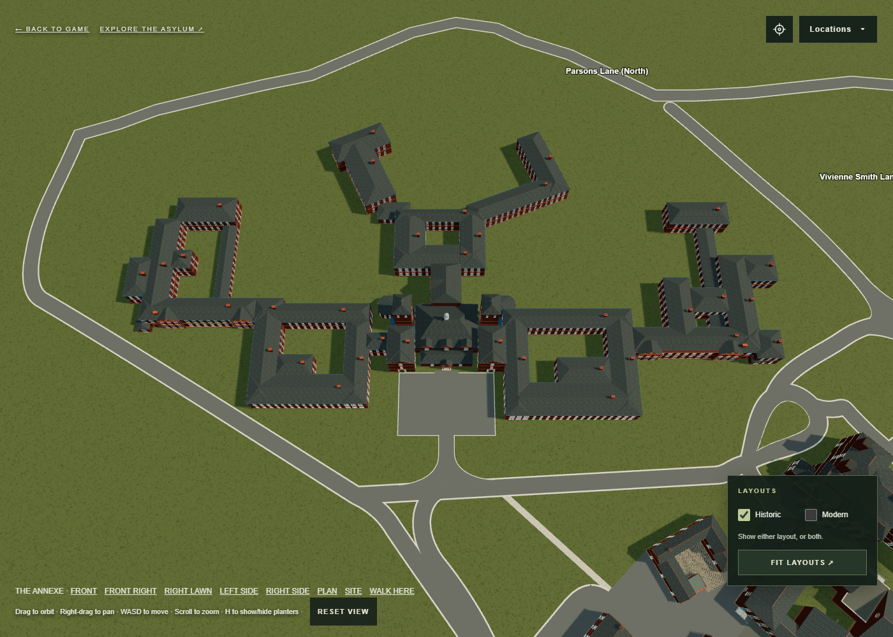

# Annexe frontage adjustment

After reviewing the rear aerial fit, the user requested a slightly larger
annexe closer to the long red frontage line in
`../annexe-placement/front-roads-annotated.png`. The accepted placement uses
horizontal scale 0.72 and root (378, -34): 12.5% larger in width and depth than
the first aerial fit. The approved ward shapes, central frontage details and
building heights are retained. The projecting wards limit the remaining
setback from the avenue; the annexe stays inside the Parsons loop and clear
of the teardrop and Main/admin.

`remove-rear-roads.png` authorizes removal of the four rear access routes,
their two Parsons Lane junction mouths, kerbs and rear hardstanding. Their
former definitions are preserved in `rear-access-before.mjs.txt`. The
surrounding shared Parsons Lane remains intact.

The user accepted this placement and then supplied `narrow-entrance.png`.
Its red outline protects the central asphalt apron; its yellow outline
narrows only the sweeping connection. The revised entrance has a straight
neck about 16% of the apron width and a smooth flare to a mouth about 98%
of the apron width. The curves join the existing oblique avenue. The apron
and step approach retain their exact world coordinates and surface, checked
against `protected-forecourt.json`. Exposed apron kerbs extend to the narrower
opening. No building or named road is moved by this entrance edit.

The annexe access checks pass, including an unbroken walking route, protected
teardrop geometry, road clearance and removal of the rear access group.
Browser plan, access and entrance views render without page errors. The
older photo-placement road snapshot currently differs from Vivienne Smith
Lane and its connected historic route outside this entrance edit; it has
not been overwritten to hide that mismatch. The earlier general Historic
roads test also reported an Admin north service road overlap outside the
annexe work.

Open `aerial.html?view=annexe-access` for the layout or
`aerial.html?view=annexe-entrance` for a closer view. This changes the browser
model; Blender and Unity exports are unchanged.

