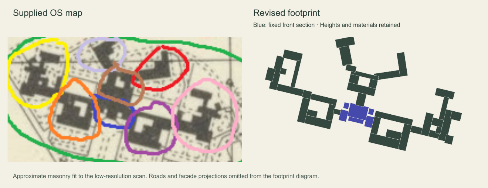
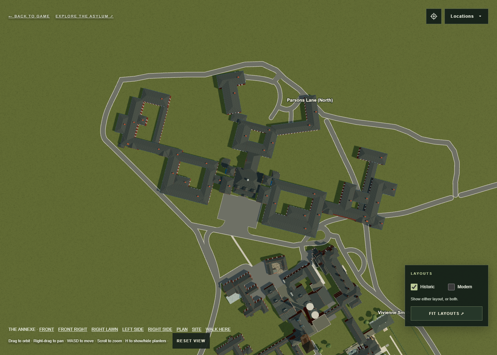

# Annexe footprint from the colour-matched OS map

The central rear block is further corrected by the [September 24 kitchen
photograph and access-court instructions](../annexe-kitchen/README.md). The other
ward shapes documented here remain approved. Their overall scale and site
position are superseded by the later [aerial-photo correction](../annexe-photo-placement/README.md),
which restores clearance inside the Parsons loop and beyond the teardrop.

The supplied `marked-os-map.png` and `matching-render.png` identify the same
seven blocks. The blue central frontage is protected. The black masonry,
rather than the freehand circles, supplies the approximate footprint.

| OS colour | Model component | Refinement |
| --- | --- | --- |
| Yellow | Larkton/Jodrell and outer connecting range | Wider placement, longer outer ward, rear link and projecting rooms |
| Orange | Tarvin/Jarman | Larger independent court, west-side notch and short entrance link |
| Purple | Picton/Carden | Separate court proportions, east-side notch |
| Pink | East outer wards | Inward rear pavilion, longer thin link, stepped inner and outer rooms |
| Brown | Central rear block | Short frontage link and four ranges around an open rear courtyard |
| Pale lavender | Rear service head | Longer angled body with offset head and short court connection |
| Red | Leighton/Newton | Longer L-shaped range, retaining its approximately 22-degree turn |

`Browser/dist/annexe-os-refinement.mjs` saves the source pixel picks and the
regularised masonry rectangles. Map frontage endpoints (76,73) and (105,80)
map to the existing local (-20,17) and (20,17) corners before applying
`ANNEXE_MAP_SCALE`. This fits the surrounding blocks to the accepted frontage;
it does not move or resize the annexe root or the blue section. The low-resolution
scan supports an approximate reconstruction, with individual edges uncertain
by roughly one or two pixels. The earlier symmetric court and shortened rear-L
assumptions are superseded.

The existing brickwork, roof treatment and heights are retained. The photographed
outer fronts follow their new host spans. The Oakmere lawn elevation fits the
shorter rear link. Generated windows, chimneys, roof geometry and walking
obstacles follow the revised ranges. Ward camera framing follows their larger
extent. Two Main/admin camera starts move forward along their existing
sightlines to stay outside the enlarged wards; Main/admin geometry is fixed.

The central forecourt and entrance dimensions are explicitly held at their
pre-refinement values, independently of the annexe's new total width. Road
positions are unchanged in this building-only pass. The new footprint intersects
existing roads at the northern Parsons connection, rear approaches and the
admin teardrop; these need a separate road realignment. The earlier model already
failed the access suite at the Admin east crossing drive. This pass leaves the
clearance assertions active so the unresolved overlaps remain visible.

Validation: 32 of 35 test scripts pass. The three remaining failures are the road
clearance suites (`test-parsons-retrace.mjs`, `test-historic-roads.mjs`, and
`test-annexe-access.mjs`); full output is saved in `test-results.json`.
The annexe tests independently check the orange, purple and brown source
courtyard pixels against roof raycasts and masonry collisions, as well as
ward framing, exposed windows and walk starts. The pre-edit fingerprint of
1,705 protected front elements matches exactly. A separate comparison of all
6,018 non-annexe meshes confirms unchanged geometry, materials and world
transforms. Browser plan, aerial and front views render without page errors.

Use `aerial.html?view=annexe-plan` or `aerial.html?view=annexe` to inspect the
result. Browser assets are updated; Blender and Unity exports are unchanged.

