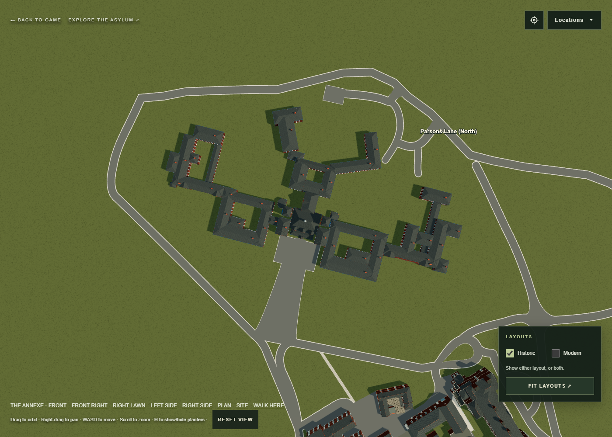
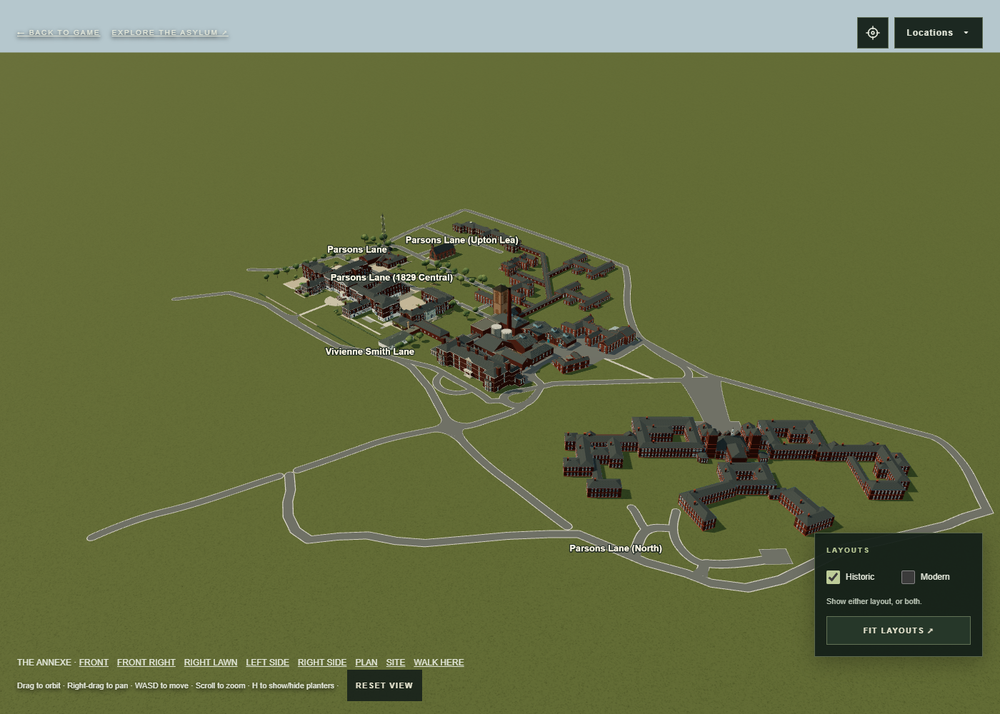

# Annexe scale and separation from Main/admin

This records the initial aerial fit. The user's later approved size, position,
rear-road removal and narrowed entrance are recorded in
[the frontage adjustment](../annexe-frontage-adjustment/README.md), which
supersedes the 64% scale and (414, -21) position below.

The user's rear aerial photograph (`aerial.png`, with `aerial-annotated.png`)
supersedes the previous interpretation of the annexe's overall scale and
placement. It identifies Main/admin, the water tower, chimney, annexe and the
small teardrop beside Main/admin. The approved OS ward shapes remain intact.

The footprint is now 64% of the previous width and depth. The entire annexe,
including the blue frontage, shares this one horizontal scale; storey heights,
roof heights, windows and local geometry are retained. The root moves from
approximately (368.37, -7.91) to (414, -21), about 47.5 scene units away from
its previous position. Its orientation is unchanged. Main/admin, the water
tower, chimney and all other building meshes retain their positions.

The previous trace inherited 2.173 scene units per source-map pixel by matching
the preserved frontage width. The site's independent OS registration is 1.419
units per pixel. The corrected plan is 1.391 units per pixel, within about 2%
of that scale. This resolves the overly large wards without redrawing their
shapes. The aerial supplies the visible separation and setting; the unchanged
road loop constrains the final fit. The photo is oblique and the existing site
is approximate, so this is a visual reconstruction rather than a surveyed fit.

The annexe sits wholly inside the Parsons loop. No road centreline or teardrop
vertex is changed. The central forecourt and sweeping entrance follow the
reduced frontage and reconnect to the existing avenue, including its kerb
opening. Rear roads and hardstanding, the perimeter, shared saved lanes and
legacy gameplay roads stay fixed. Ward cameras follow the site fit. A new
**Annexe / Main · aerial photo** location (`aerial.html?view=annexe-photo-site`)
shows the relationship from the rear, while `?view=annexe-plan` shows clearance.

`Browser/dist/annexe-photo-placement.mjs` owns the scale and position. The prior
OS picks and detailed range rectangles remain in `annexe-os-refinement.mjs`.

Validation checks the unchanged local geometry of all 22,638 annexe elements,
including a separate 1,705-element frontage fingerprint. It also checks every
masonry edge inside the loop, unchanged road vertices, the separation from
Main/admin and the teardrop, accessible entrances, open courtyards, roofs,
exposed windows, ward framing and walking collisions. The measured model gaps
are at least 18.7 units to the loop centreline, 60.8 to the teardrop island and
81.0 to Main/admin's masonry, using the padded footprint checks. These are model
measurements, not distances surveyed from the photograph.

The annexe access and Parsons clearance tests pass; 35 of 36 scripts pass overall.
The full test output is in
`test-results.json`; the only remaining failure is the previously existing
Admin north service road overlap at approximately (228.89, -4.52), outside this
annexe correction. A separate comparison confirms all 6,018 non-annexe meshes
have unchanged geometry, materials and world transforms. Browser plan, front
and rear site views render without page errors.

This updates the browser model; Blender and Unity exports are unchanged.

