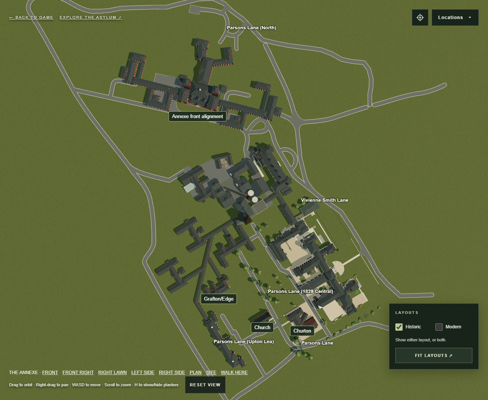
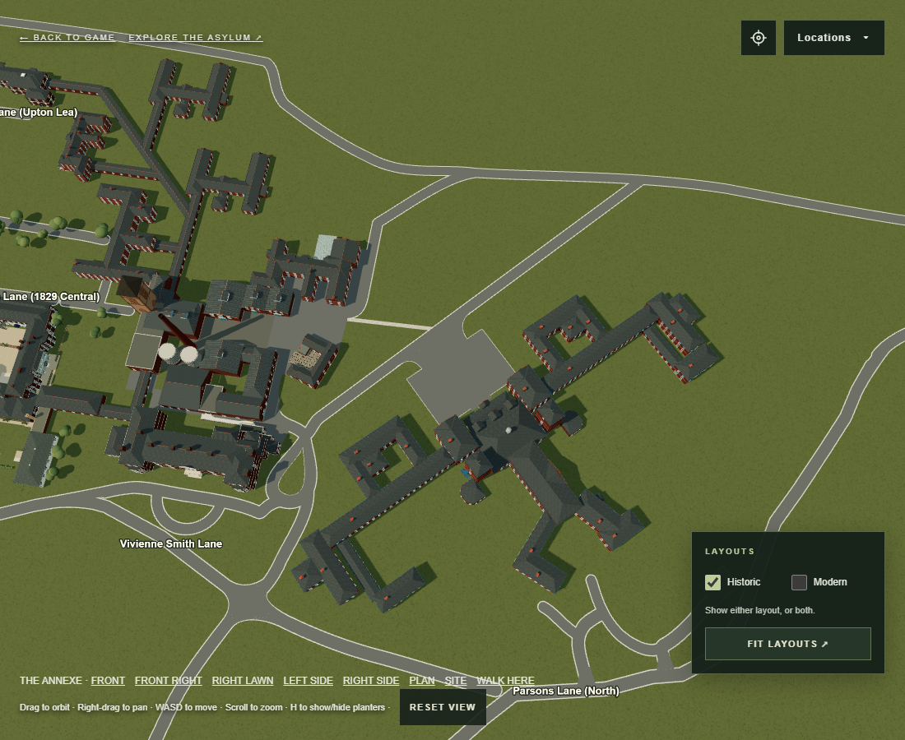

# Annexe alignment from the marked OS map

The supplied 322 × 385 extract identifies the annexe in green, church in red,
Churton in blue and Grafton/Edge in yellow. The purple line identifies the
central front section, as confirmed by the second supplied screenshot. The
outer wings are excluded from the registration because their dimensions are
uncertain.

`Browser/dist/annexe-placement.mjs` fits a uniform map scale and rotation to
the three fixed building centres. It then places the midpoint of the annexe's
front pavilion faces on the midpoint of the purple line and makes those faces
parallel to it. The existing building width, depth, height and local geometry
are preserved; the purple stroke is used for position and direction, not to
resize the frontage or wings.

| Reference | Map pixel | Fixed scene X, Z | Fit residual |
| --- | --- | --- | --- |
| Church | 164, 323 | -4.9, -119.2 | 4.00 |
| Churton | 210, 323 | -44.3, -65.9 | 2.35 |
| Grafton/Edge | 118, 288 | 73.5, -155.8 | 1.87 |

The purple endpoints are (80, 83) and (107, 90). The registered front midpoint
is approximately scene (349.26, -27.75). The annexe root moves from
(434.40, -18.74) to (368.37, -7.91), with a -2.10° change in its Y rotation.
These are approximate placements from the scan, not surveyed dimensions.

The original outline registration and `ANNEXE_MAP_SCALE` remain solely to
preserve the model's existing dimensions. The Historic access roads, forecourt,
hardstandings and legacy gameplay tracks retain their previous world coordinates
through the independent `annexe-ground-placement.mjs` frame. No other building
is moved. Annexe cameras follow the building, and the plan/site views use the
new map orientation. The Main/admin east camera steps forward along its existing
sightline to stay outside the relocated wing; its building stays fixed.

Road integration is intentionally deferred: the relocated wings intersect
parts of the fixed annexe access network and the old forecourt no longer meets
the central entrance. The full site road-clearance regression already failed
before this edit for earlier ward moves and also reports these annexe overlaps.
The fixed-road surface test no longer assumes those surfaces follow the building;
site-wide clearance remains checked separately by `test-historic-roads.mjs`.

An immediate pre/post comparison checked all 10,402 non-annexe scene nodes
and all Historic road data; their geometry and world transforms matched.
All annexe building geometry, instance transforms and dimensions also match,
and the four legacy drives retain their world positions. The annexe tests check
the actual front masonry against the purple line, all three fixed landmarks,
open courts, roofs, facade details and walking collisions. Headless browser
renders of the site, annexe plan and adjusted photo camera have no page errors.
Thirty of the 31 existing check scripts pass, including the added alignment
checks; the remaining script reports the deferred site road-clearance issues.
The browser model is updated; Blender and Unity exports are unchanged.

Open `aerial.html?view=annexe-site` or `aerial.html?view=annexe-plan` locally.

## Frontage roads from the later red/yellow/purple annotation

The user's `front-roads-annotated.png` supersedes the decision to keep the
frontage roads fixed. The long avenue follows the red line between the northern
boundary and the translated teardrop. A short curved mouth joins the teardrop;
the remaining frontage is straight. Its former alignment through the annexe
is removed.

The complete teardrop carriageway, resurfacing, lawn and inner kerb translate
by (-16, -12) scene units toward Main/admin. Every original curve vertex,
road width and relative dimension is retained. Its connecting approach roads
are adjusted locally to maintain open junctions and clear the buildings.

A 2.4-unit-wide gravel path follows the yellow line from the service court to
the avenue, with an open mouth through the road kerb. The central asphalt
forecourt and 60%-width sweeping entrance now meet the annexe front and the
new avenue. Both side approach roads, their kerbs and the associated east
roadside hardstanding are removed. Rear roads and the rear hardstanding remain
at their existing coordinates. Buildings, the Main/admin semicircular forecourt
and saved modern lanes are unchanged.

`Browser/dist/annexe-front-roads.mjs` records the annotation picks, road endpoints,
teardrop translation and gravel path. Screenshot registration is approximate;
the north endpoint is snapped to the existing boundary road, and the teardrop
position allows clearance from Main/admin within the purple-marked area.

The updated access test checks original teardrop vertex signatures, full-width
building clearance for the edited roads, continuous walking/asphalt between
the front door and avenue, gravel access, removed side roads, rear junctions
and Historic/Modern visibility. A pre/post snapshot confirms unchanged building
geometry and transforms. The wider road-clearance test still reports the
pre-existing Admin north service road overlap outside this frontage work.

Open `aerial.html?view=annexe-roads` for this view.

