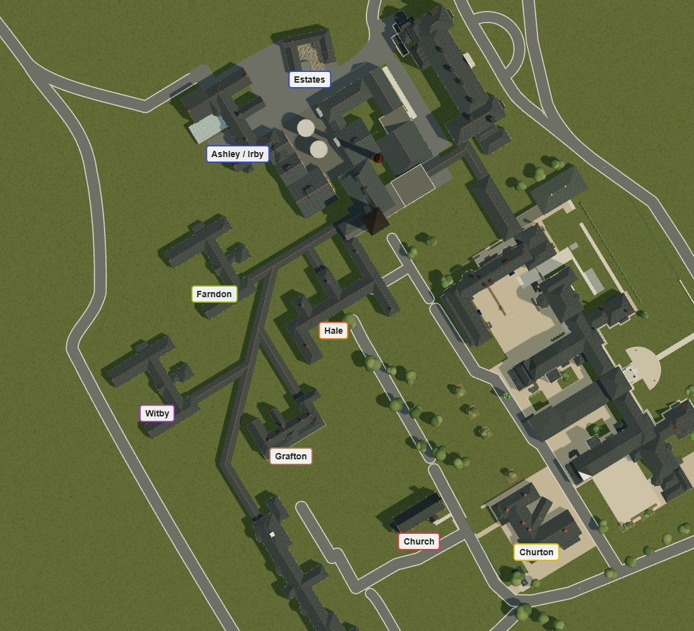

# Ward positions from the overhead map

The supplied `marked-plan.png` fixes the church (red) and Churton (yellow)
and identifies Witby (purple), Farndon (green), Ashley/Irby (blue),
Grafton/Edge (brown) and Hale/Daresbury/Huxley/Dunham (orange).

`Browser/dist/ward-placement.mjs` fits a uniform scale and rotation between
the two fixed landmark centres, then uses that registration to locate the
five ward centres. Only the ward positions change: their scale, rotation,
roof and facade geometry remain intact. The low-resolution map, visually
selected centres and existing model shapes make these approximate positions.

| Building | Map centre, pixels | Previous scene X, Z | Updated scene X, Z |
| --- | --- | --- | --- |
| Church | 208, 318 | -4.9, -119.2 | unchanged |
| Churton | 252, 322 | -44.3, -65.9 | unchanged |
| Witby | 110, 270 | 117.7, -211.8 | 133, -207.5 |
| Farndon | 128, 220 | 173.7, -160.8 | 173.7, -145.4 (straight-corridor alignment) |
| Ashley/Irby | 140, 173 | 234, -118 | 234, -93.4 |
| Grafton/Edge | 160, 286 | 67.33, -165.11 | 73.5, -155.8 |
| Hale/Daresbury/Huxley/Dunham | 176, 239 | 118.7, -111 | 121.3, -98.7 |
| Estates | 167, 145 | 246.3, -49.5 | 248.9, -37 |

The builders retain their source coordinates so Grafton's copied geometry
and Witby's Farndon copy are unaffected. Placement runs after construction
and copying, translates world-space metadata, and leaves local geometry and
collision outlines intact. Aerial, photo and walking presets follow each move.

The subsequent corridor correction fixes the Main–tower–Farndon gallery at
x=156.3, perpendicular to the back of Main and directly beside the water
tower on the chimney side. Its wall is 0.5 units beyond the tower wall, as
in `Research/admin-corridor/farndon-route-reference.png`. It remains one
straight run, from z=9.8 to z=-132.1, with no corners or offset connector.
Farndon's x-position is refined from the initial approximate map fit of
183.1 back to 173.7 so its receiving wing meets the full corridor width;
its corrected map z-position is retained.

The diagonal spine and Upton endpoint stay anchored. Witby and Grafton's
branches now reach their moved walls, and Hale's two links follow its moved
wings back to the straight gallery. Roofs, windows at the joins and walking
collisions follow the reconnections. Archived OS reference data stays fixed.

`estates-plan.png` adds the blue-circled Estates building to the same two-
landmark registration. Its 2.6-unit x and 12.5-unit z move carries the
courtyard, doors, collisions and photo views; its existing 19-degree angle
and dimensions are retained. Church and Churton remain fixed.

Road routes retain their previous positions.
The existing full-width road-clearance regression now reports overlaps of
Admin north service road and Tower north court lane with Ashley/Irby, and
Churton eastern link with Hale. These road alignments remain to be resolved
in a later layout edit. The corridor, placement and Estates checks pass;
the broad road-clearance check still reports those deferred overlaps.

This supersedes the earlier ward placement notes. Browser aerial, walking
and gameplay use these positions; the Blender and Unity exports are unchanged.

Validation includes the existing ward geometry and corridor tests, independent
placement/collision checks, a before/after comparison of every unchanged scene
object and all five wards' geometry, and the directly overhead browser render
below. `node Browser/test-ward-placement.mjs` checks the five placements,
building geometry, views and collisions. `node Browser/test-ward-corridors.mjs`
checks the straight route, chimney-side clearance, six ward contacts and
2,421 rendered roof samples. `node Browser/test-estates.mjs` checks the
registered location, preserved shape, courtyard and walking access.

