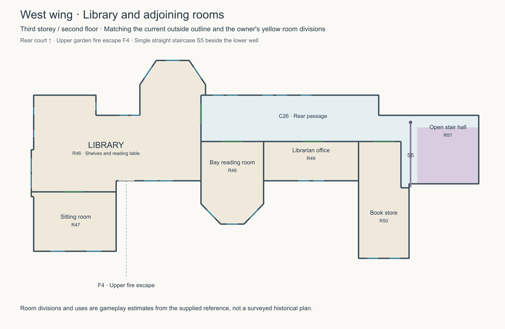

# West-wing Library storey — 5 October 2026

The latest [single-stair correction](../west/single-library-stair-2026-10-05/README.md)
supersedes the two-flight and diagonal-return descriptions below. Library
access now uses one straight north-rising flight beside the lower well.

The owner's [marked exterior screenshot](reference.png) requests the Library
and adjoining rooms on the unmodelled third storey, following the outside
building outline and yellow room divisions, with access from the fire escape
and an enclosed staircase near the blue X. The annotation is modelling
evidence; the written request defines the work.

This is now implemented in the browser's second-floor level, plan ID 3,
Y=8.4. This is the third occupied storey and matches the existing exterior
fire-escape door at Y=8.5. It adds a separate west-wing envelope alongside
the retained Reception upper floor. The current west exterior, including
the stepped court return, canted bays, shallow end pier and inner square
projection, supersedes the older lower-floor outline for this new storey.

R46 is the large Library; R47 is the outer sitting room; R48 occupies the
garden-facing canted reading bay; R49 is an adjoining office; R50 provides
book storage in the inner square return. C26 is the rear passage. The
outer sitting-room partition is set at z=14.6 to avoid cutting through the
existing end-wall sash. The Library door is centred at z=6.85 to retain full
jamb support beside the reading room's perpendicular partition. Concealed
divisions and adjoining-room uses are gameplay estimates, not historical
measurements or a surveyed room inventory.

S5, at the existing west junction near the marked X, continues from first
floor to this storey. R51 encloses its west, east and rear edges on both
levels, with the north landing open. The flight positions, guarded well
and concrete undersides use the existing stair model. F4's upper exterior
door now enters the Library from (-63,8.5,14.3). Its new per-level interior
anchor is on the actual garden wall at z=13.5; the earlier first-floor
interior anchor and exterior arrival are preserved.

The 26 exposed upper west sashes are taken from the existing exterior
detail builders, then projected onto their hosting wall planes. Widths,
heights and horizontal orientations follow those sources. Vertical sills
fit the game's established 3.8-unit interior ceiling convention. There are
31 scheduled windows on this level including Reception's retained five.

The Library has eight stocked bookcases, a reading table, chairs and books.
The adjoining rooms use the existing sitting, reading, office and archive
furnishings. Central table candidates pass the shared collision, shelf-front,
door and route-clearance checks. Room discovery, notebook mapping, pursuer
routes, lighting and the developer stair overlay consume the same plan.
Navigation can now descend and ascend again between disconnected wings on
the same upper storey.

Both shared JSON plans and the first-floor stair drawing are updated.
Reception retains its own readable second-floor drawing; this directory
contains the full Library plan. Review captures and the saved former plan
are in `../../Browser/artifacts/west-library/`. Run
`npm run test:west-library` from `Browser` for the physical route and GPU
browser checks. Detailed validation is recorded in `../../DEVELOPMENT.md`.

Only browser interior sources, checks and review drawings are changed.
The aerial compiler excludes these sources, so this addition needs no aerial
rebuild. Unity, Blender and packaged application exports are not regenerated.

## Open upper stair correction — 5 October 2026

The owner's later [marked stair view](../west/upper-access-stair-2026-10-05/README.md)
supersedes the enclosed continuation described above. R51's internal enclosure
is removed on both adjoining levels. S5's upper return rises diagonally across
the well to the west side of the corridor landing, following the blue line;
fitted landings, rails, visible treads and walking use the same geometry. The
lower connections retain their positions. The Library plan and first-floor
stair drawing are regenerated for this correction.

## Wider rear passage — 5 October 2026

The owner's [blue-line corridor screenshot](corridor-reference.png) widens the
passage at the stepped court wall near the Library. R48, R49 and R50's joined
room-side boundary moves from z=8.2 to z=9.6, carrying their green doorways
with it. The narrow section beside the court return grows from 1.2 to 2.6
scene units between wall centrelines (2.42 clear of the masonry). The wider
straight section grows from 3.2 to 4.6. These are owner-directed gameplay
dimensions interpreted from the screenshot.

C26 reserves a 2.6-unit route through the bend and still meets S5's reviewed
west landing. Both shared plans and this directory's plan drawing are updated.
Rendering, walking collision, furniture clearance, navigation and notebook
mapping derive from those shared boundaries. The outside outline, window
records, stair geometry, fire-escape anchors and other floors are retained.
Validation and before/after captures are in
`../../Browser/artifacts/west-library-corridor/`; detailed results are recorded
in `../../DEVELOPMENT.md`. Only browser interiors and the review drawing change;
the aerial compiler excludes these plans, and Unity/Blender/package exports
are not regenerated.
